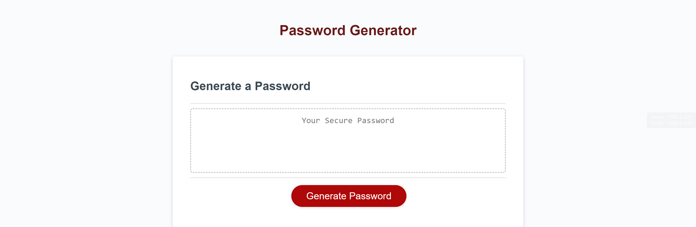

# Password-Generator
Application that someone can use to generate a random password based on criteria selected.

&nbsp;&nbsp;&nbsp;&nbsp;&nbsp;&nbsp;

---
## Installation

No installation is required.
Click [here](https://lorettarehm.github.io/Password-Generator/) to access the page.

## Usage 
The webpage includes a title, a field where the password generated will be provided and a button for the user to request a password to be generated "Generate Password":

## Credits
* Trilogy Education Services

## [License](./LICENSE)
